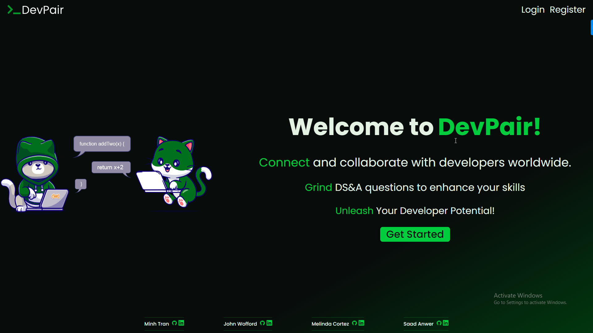
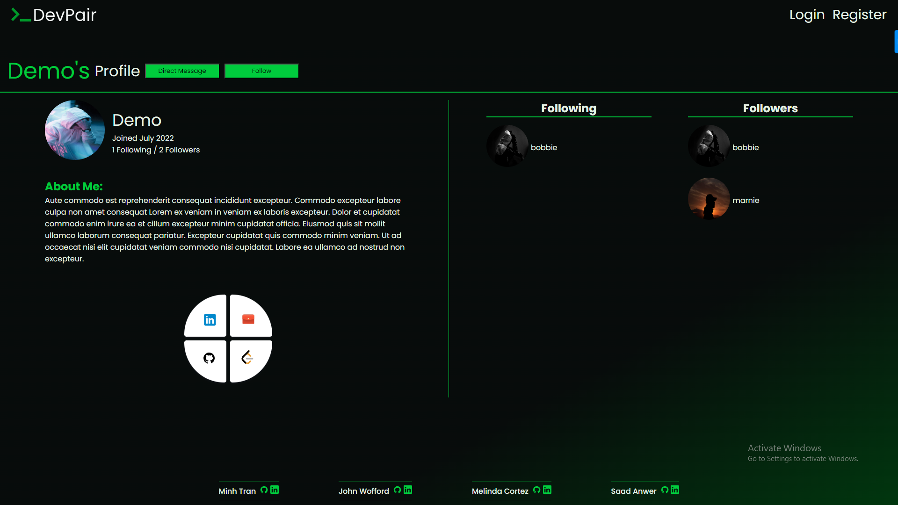
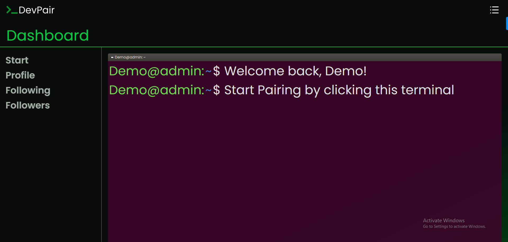
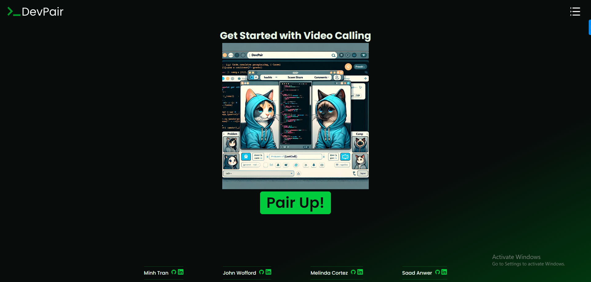
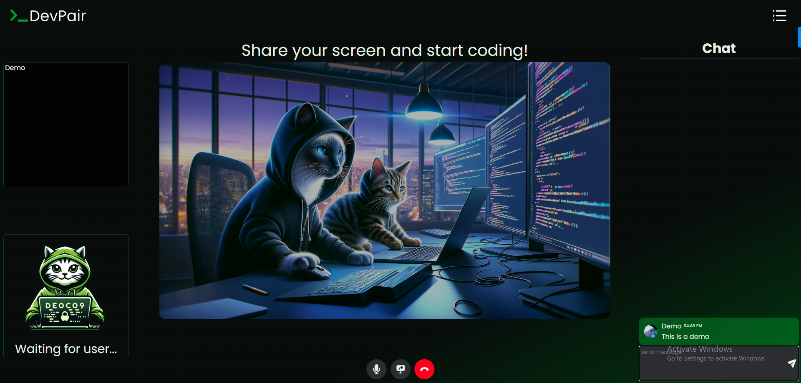

# $${\color{blue}Winter \space Hackathon-Dev-Pair}$$
<!-- FORMAT FOR THIS STYLING: $${\color{red}Welcome \space \color{lightblue}To \space \color{orange}Stackoverflow}$$ -->
$${\color{red}by \space \color{lightblue}Minh, \space \color{lightblue}Melinda}$$

# The Official DevPair Repository
- ### This is where we'll be constantly updating this project to its full potential.

# About
- **Accessibility-Focused**: Designed to assist users in finding pair-programming partners for practicing Data Structures & Algorithms.
- **Random Pairing Mechanism**: Implements a first-in, first-out system for connecting users randomly.
- **Interactive Platform**: Offers video camera sharing and chat functionalities for enhanced communication and problem-solving collaboration.
- **Community-Driven Initiative**: Aims to serve users struggling to find programming partners, fostering a supportive community environment.
- **Flexible Pairing Options**: Allows users to link up with a partner or choose to connect with a different participant.

# Features (MVPs)
1. Video Calling
2. Chatting
3. User Follower/Following
4. Screen Sharing

### Features Coming Soon
5. IDE DS&A Tests
6. User Direct Messaging
7. User Statistics

# Technology
1. Python (Server Side Language)
2. Flask (Framework)
3. React (JavaScript Library)
4. Redux & @reduxjs/toolkit (State Management)
5. TypeScript (Client Side Language with a strict syntactical superset of JavaScript and adds static type definitions)
6. [Flask-SocketIO](https://flask-socketio.readthedocs.io/en/latest/) (Extension for Flask that adds WebSocket support)
7. Agora-RTC (Enhanced version of WebRTC to offer real-time voice and video communication capabilities)
8. PostgreSQL (Production-DB)
9. SQLite (Development-DB)
10. SQLAlchemy (SQL toolkit & Object-Relational Mapping (ORM) library for Python)

# Project Demo
<!--





-->


<br>
<br>


# Getting Started

## Prereq:
1. Signup for [Agora-RTC](https://sso2.agora.io/en/v6/signup)
2. Grab your `App ID` as you will need it in the `client` folder `.env` file for the key `VITE_APP_ID`

## Method 1: Use setup.sh script
- Run the install script in your terminal
    - `sh setup.sh`
        - This script will create a `.env` with necessary variables and values for you to initialize the project and install all dependencies on the client and server.
- Terminal 1:
    - `cd into client`
    - create a `.env` file
    - according to the `.env.example` in the `client folder` fill out your appId for the key `VITE_APP_ID=<your appId>`
    - `npm run dev`
- Terminal 2:
    - `cd into server`
    - `pipenv shell`
    - `flask run`

## Method 2: Manual

### Server
- `cd` into the server folder
- Create a `.env` file with a key
    - `SECRET_KEY=<your secret key>`
    - `DATABASE_URL=sqlite:///dev.db`
    - `SCHEMA=<schema_name>`
- `pipenv install -r requirements.txt`
- `pipenv shell`
- `flask db migrate`
- `flask db upgrade`
- `flask seed all`
- `flask run`

### Client
- `cd` into the client folder
- Create a `.env` file and fill out your appId for the key `VITE_APP_ID=<your appId>`
- `npm i`
- `npm run build` in one terminal for typescript
- `npm run dev` in another terminal


# Deployment

### Build Command
- `./build.sh`
- Inside build.sh
    ```
    #!/bin/bash

    # Stop the script if any command fails
    set -e

    # Navigate to the client directory and run npm commands
    echo "Installing client dependencies and building the client..."
    cd client
    npm install
    npm run start
    cd ..

    # Navigate to the server directory and run pip commands
    echo "Installing server dependencies and setting up the database..."
    cd server
    pip install -r requirements.txt
    pip install psycopg2
    flask db upgrade
    flask seed all
    cd ..

    echo "Build and setup completed successfully!"
    ```

### Start Command
- `cd server && gunicorn -k gevent -w 1 app:app`

### Versions File
```
from alembic import op
import sqlalchemy as sa
import os
environment = os.getenv("FLASK_ENV")
SCHEMA = os.environ.get("SCHEMA")

if environment == "production":
        op.execute(f"ALTER TABLE users SET SCHEMA {SCHEMA};")
        op.execute(f"ALTER TABLE chatrooms SET SCHEMA {SCHEMA};")
        op.execute(f"ALTER TABLE direct_messages SET SCHEMA {SCHEMA};")
        op.execute(f"ALTER TABLE following SET SCHEMA {SCHEMA};")
        op.execute(f"ALTER TABLE messages SET SCHEMA {SCHEMA};")
```

### env.py
```
from __future__ import with_statement

import logging
from logging.config import fileConfig

from sqlalchemy import engine_from_config
from sqlalchemy import pool

from alembic import context

import os
environment = os.getenv("FLASK_ENV")
SCHEMA = os.environ.get("SCHEMA")


# this is the Alembic Config object, which provides
# access to the values within the .ini file in use.
config = context.config

# Interpret the config file for Python logging.
# This line sets up loggers basically.
fileConfig(config.config_file_name)
logger = logging.getLogger('alembic.env')

# add your model's MetaData object here
# for 'autogenerate' support
# from myapp import mymodel
# target_metadata = mymodel.Base.metadata
from flask import current_app
config.set_main_option(
    'sqlalchemy.url',
    str(current_app.extensions['migrate'].db.engine.url).replace('%', '%%'))
target_metadata = current_app.extensions['migrate'].db.metadata

# other values from the config, defined by the needs of env.py,
# can be acquired:
# my_important_option = config.get_main_option("my_important_option")
# ... etc.


def run_migrations_offline():
    """Run migrations in 'offline' mode.
    This configures the context with just a URL
    and not an Engine, though an Engine is acceptable
    here as well.  By skipping the Engine creation
    we don't even need a DBAPI to be available.
    Calls to context.execute() here emit the given string to the
    script output.
    """
    url = config.get_main_option("sqlalchemy.url")
    context.configure(
        url=url, target_metadata=target_metadata, literal_binds=True
    )

    with context.begin_transaction():
        context.run_migrations()


def run_migrations_online():
    """Run migrations in 'online' mode.
    In this scenario we need to create an Engine
    and associate a connection with the context.
    """

    # this callback is used to prevent an auto-migration from being generated
    # when there are no changes to the schema
    # reference: http://alembic.zzzcomputing.com/en/latest/cookbook.html
    def process_revision_directives(context, revision, directives):
        if getattr(config.cmd_opts, 'autogenerate', False):
            script = directives[0]
            if script.upgrade_ops.is_empty():
                directives[:] = []
                logger.info('No changes in schema detected.')

    connectable = engine_from_config(
        config.get_section(config.config_ini_section),
        prefix='sqlalchemy.',
        poolclass=pool.NullPool,
    )

    with connectable.connect() as connection:
        context.configure(
            connection=connection,
            target_metadata=target_metadata,
            process_revision_directives=process_revision_directives,
            **current_app.extensions['migrate'].configure_args
        )
        # Create a schema (only in production)
        if environment == "production":
            connection.execute(f"CREATE SCHEMA IF NOT EXISTS {SCHEMA}")

        # Set search path to your schema (only in production)
        with context.begin_transaction():
            if environment == "production":
                context.execute(f"SET search_path TO {SCHEMA}")
            context.run_migrations()

if context.is_offline_mode():
    run_migrations_offline()
else:
    run_migrations_online()
```
